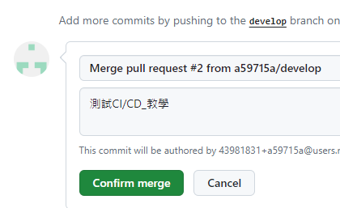

# Jenkins CI/CD with Cron on Windows

#### 前言

Jenkins 是一個開源的自動化工具，用於自動化各種任務，包括構建、測試和部署軟件。Jenkins 可以通過自身的 Web 介面進行配置，也可以通過插件擴展其功能。Jenkins 提供了一個易於使用的持續集成系統，使開發人員能夠快速發現和解決錯誤。

##### 情境

1. 專案服務架設在區網內，本文以架設 Windows 本機環境為例
2. 無法由外網 Call 內部 API，所以無法使用 Webhook 進行自動化部署
3. 使用 GitHub 作為版本控制工具
4. GitHub 專案上有兩個 Branch： develop 以及 master ，develop 用來開發，開發完後 merge 到 master 去 ，master Branch 用來部署服務

##### 目標

此次的目標是做到 將程式碼異動進行 Pull Request 後，Jenkins 會自動把 master Branch 部署到 Server 上

---

#### 1. 安裝 Jenkins

[點我進入下載頁面](https://www.jenkins.io/download/)

以 Windows 版本 2.460 版本 為例


安裝過程基本上參考 網路上教學該填啥填啥該下一步就退一步即可
過程中有幾個特別需要注意

##### 登入密碼的設置

- 選擇上方的選項 會於登入時告訴您初始密碼存在哪裡，請登入時自行查看
  (我採用的方式)
- 選擇下方的選項 根據其他教學表示，您需要設置電腦 User 去登入，設定請參考[設定教學](https://medium.com/on-my-way-coding/%E5%88%9D%E6%8E%A2ci%E5%B7%A5%E5%85%B7-jenkins-windows%E7%92%B0%E5%A2%83%E5%AE%89%E8%A3%9D-81765fee3532)

  

##### 設定 Java

- Jenkins 需要 Java 環境，請確認您的電腦有安裝 JAVA 例如我的路徑是
  C:\Program Files\Java\jdk-17
  請依照您的 Java 版本 進行設定
  

若沒安裝 Java 請先進行安裝 我的 Java 版本是 17 ，請依照安裝提示所接受版本進行安裝
[Java17 下載](https://www.oracle.com/tw/java/technologies/downloads/#jdk17-windows)


---

#### 2. 進入 Jenkins

##### 登入密碼

- 開啟瀏覽器 輸入 localhost+設定的 port 預設是：localhost:8080
  這邊我設定 9999
  初次開起會進入引導頁面，告訴你你的密碼在哪裡
  此圖截自網路
  
  我的密碼在 C:\ProgramData\Jenkins\.jenkins\secrets 中 initialAdminPassword 檔案，拖進記事本裡面即可看到密碼
  

  

##### 安裝插件

- 安裝完後會進入插件安裝頁面，這邊選擇 **安裝推薦的插件**
  安裝完後會進入 Jenkins 首頁

  特別說一下
  **此處的網路環境很重要**

  **此處的網路環境很重要**

  **此處的網路環境很重要**

  我在安裝時使用公司預設的 Proxy 設定進行安裝，也進行 Proxy 設定，不確定是否設定有誤，導致後續的插件安裝失敗，所以建議在安裝時，確保網路環境設定是單純的。

  我這邊是 先去 **Installed plugins** 查看有哪些套件異常，他會寫相依的\*\*\*套件異常，複製起來去**Available plugins** 裡面找到相依的套件安裝即可
  

##### 修改密碼

- 登入後請記得修改 admin 密碼 步驟如下
  - 點選右上角的 admin
  - 選擇 Configure(設定)
    
  - 在下方找到 Admin Password (密碼)
    
  - 輸入新密碼
  - 儲存

---

#### 3.GitHub 準備

- 進入 GitHub 將你的專案網址以及 Clone 網址 抓下來
  例如我的專案網址是 **https://github.com/a59715a/CICDTest**
  Clone 網址是 **https://github.com/a59715a/CICDTest.git**

  

- 進入 Settings => Developer Settings => Personal access tokens
  點選 Generate new token
  

  

  

- 設定 名稱 、 Expire 時間 、 權限
  最後拉到下面按下 Generate token
  

#### 4.設定 Jenkins Credentials

這一步是為了讓 Jenkins 可以連接到 GitHub ，可以想成把帳號密碼綁定在 Jenkins 上，這樣 Jenkins 就可以透過這個帳號密碼去連接到 GitHub，但密碼的部分是你的 Personal access tokens

步驟如下

若找不到可以參考以下連結，請再自行調整成您的 port
http://localhost:9999/manage/credentials/store/system/domain/_/

- 點選 Jenkins 左側的 管理 Jenkins
- 選擇 Security 分類中的 Credentials
  
- 選擇 Global
  
- 選擇 Add Credentials 
- 選擇 Kind => Username with password
- 輸入 Username => GitHub 帳號
- 輸入 Password => 剛剛生成的 Personal access tokens
- 輸入 ID => 我是輸入 GitUser 自己清楚即可
- 點選 Create
  

---

#### 5.設定 自動化部署

**前面搞了這麼多現在終於要開始設定排程了!!!**
那我們開始吧!!

##### 初步設定

- 新增作業 => 輸入名稱 => 選擇 Freestyle project => 確定
  

  

* 在 GitHub project 輸入你的專案網址
  
* 依序填入 clone 網址、Credentials、Branch
  - Repository URL 輸入剛剛的 Clone 網址
  - Credentials 選擇剛剛設定的 GitHub 帳號密碼 Credentials
  - Branch 選擇 master
    

##### 解決 SSL 錯誤(若有發生)

- 若這兩個步驟顯示類似下方的 SSL 錯誤訊息，因為我的是自簽憑證，所以會有這個錯誤，若無法繼續可以依照此步驟處理

  ```
  Failed to connect to repository : Command "git.exe ls-remote -h -- https://github.com/a59715a/shift-scheduleCICD.git HEAD" returned status code 128:
  stdout:
  stderr: fatal: unable to access 'https://github.com/a59715a/shift-scheduleCICD.git/': SSL certificate problem: self-signed certificate in certificate chain
  ```

  - Jenkins 主頁 => 管理 Jenkins => System => 找到 Git plugin 標籤 => 在 Global Config user.name Value 標籤中填入

  ```
  -c http.sslVerify=false
  ```

  

  
  這樣調整基本上就處理完錯誤了

##### 設置 觸發時機、執行動作

- 建置觸發器
  我的情境，選擇 **輪詢 SCM** 這是每隔一段時間去檢查 Repository 有沒有 Pull Request，若有異動就會進行部署 ，排程撰寫方式依照 Cron 表達式
  圖中範例為 5 分鐘檢查一次依需求調整
  `H/5 * * * *`

  

- 建置步驟 Build Steps
  此處我選擇 Windows 批次指令，即可直接將.bat 檔案的指令貼上
  分開寫是因為有些指令執行完就結束了，也不想增加複雜度，就先以分開方式寫
  

* 動作內容請參照指令註解
  此處用口語敘述一下流程
  1. 進入專案目錄
  2. 獲取最新的 Code
  3. 安裝依賴
  4. 更新 browserslist 數據庫 (更新資瀏覽器支援列表)
  5. 設置 CI 環境變量為 false (CI 環境變量為 true 時，會將所有警告視為錯誤，這樣會導致部署失敗，此處指的警告包含宣告變數但未使用)
  6. 構建項目
  7. 準備當下 datetime 變數
  8. 移除 datetime 中的 /、:、- 字元
  9. 複製現有的 build 文件夾並加上日期和時間，簡單來說就是備份一版
  10. 複製新的 build 內容到 IIS 應用程式所指定的目錄，這樣就完成部署

```WindowsBatchCommand
@echo off
REM 進入專案目錄
cd /d "C:\ProgramData\Jenkins\.jenkins\workspace\TEST"
REM 獲取最新的代碼
git pull origin master
REM 安裝依賴
npm install
```

```WindowsBatchCommand
REM 更新browserslist數據庫
npx browserslist@latest --update-db
```

```WindowsBatchCommand
REM 設置CI環境變量為false
set CI=false
REM 構建項目
npm run build
```

```WindowsBatchCommand
REM 設置datetime變數
set "datetime=%date%_%time:~0,5%"

REM 移除/、:和-
set "datetime=%datetime:/=%"
set "datetime=%datetime::=%"
set "datetime=%datetime:-=%"

REM 複製現有的build文件夾並加上日期和時間
xcopy "D:\IIS\ShiftSchedule\build" "D:\IIS\ShiftSchedule\build_%datetime%" /E /I /Y

REM 複製新的build內容到IIS目錄
xcopy "C:\ProgramData\Jenkins\.jenkins\workspace\TEST\build\*" "D:\IIS\ShiftSchedule\build" /E /I /Y
echo 部署完成
```

##### 驗證操作是否正確

###### 手動測試

1. 直接點擊 **馬上建置** 點完可能反應比較慢未刷新 請自行按 F5
   
2. 點擊 **建置歷程** 可以看到建置的過程
   

###### 自動化測試

1. 去此專案撰寫一行註解 推送 到 Develop Branch
   

   

2. 去 GitHub Web Repo 頁面 => Pull Request => New Pull Request => Create Pull Request => Merge Pull Request => Confirm Merge
   

   

   

   

###### 偵錯 及 驗證

1. 進入主控台輸出可以看到建置的過程，若有錯誤會顯示在這裡，可依序確認是否都有執行成功
   

   

2. 去 IIS 應用程式指向目錄 確認是否有部署成功 以及備份是否有成功
   
3. 去瀏覽器測試服務是否有 work
   

#### 總結


#### 參考資料

[ChatGPT 大神](https://chatgpt.com)

[初探 CI 工具-Jenkins windows 環境安裝](https://medium.com/on-my-way-coding/%E5%88%9D%E6%8E%A2ci%E5%B7%A5%E5%85%B7-jenkins-windows%E7%92%B0%E5%A2%83%E5%AE%89%E8%A3%9D-81765fee3532)

[Jenkins 教程：在 Windows 平台安装 Jenkins](https://www.cnblogs.com/dotnet261010/p/11495762.html)

[稀土掘金 - Windows 系统下 Jenkins 安装、配置自动化部署 vue 项目](https://juejin.cn/post/7171741567751815199)

[世界破破烂烂小猫缝缝补补](https://www.facebook.com/homeycutepet/videos/%E4%B8%96%E7%95%8C%E7%A0%B4%E7%A0%B4%E7%83%82%E7%83%82%E5%B0%8F%E7%8C%AB%E7%BC%9D%E7%BC%9D%E8%A1%A5%E8%A1%A5/1179515353465154/?_rdr)
